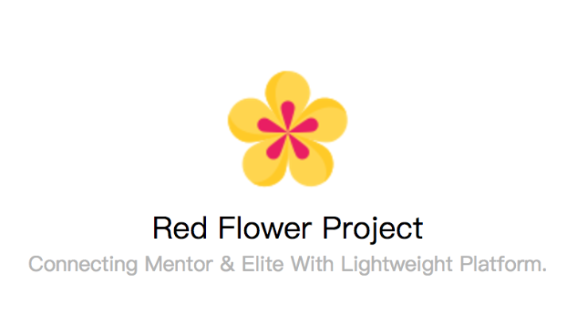

# Red Flower Project




> Connecting Mentor & Elite With Lightweight Platform.

## 目录
* [背景](#背景)
* [分支说明](#分支说明)
* [安装](#安装)
* [项目结构图](#项目结构图)
* [开发进展](#开发进展)

## 背景

小红花小程序是链接校内优秀人才与海鲸基金会的轻量级信息共享交流平台。

该仓库是项目的**前端代码仓库**，开发框架采用`wepy`。

## 分支说明

主要分为两个分支：

* master分支：稳定版本的.wpy文件编译后代码，**请勿在通过测试前**将develop分支合并到master分支，请勿在master分支上直接做修改。
* develop分支：开发人员的开发用分支，请每次在开发前先执行`pull`操作或者`fetch`操作以获取最新的远程代码。

## 安装

### 克隆仓库

```
$ git clone https://github.com/TGclub/FLWAPP.git
```

### 进入文件目录

```
$ cd FLWAPP
```

### 下载依赖

```
$ npm install
// 如果有cnpm，请用cnpm下载依赖
```

### 进入开发模式

```
$ npm run dev
```

> 在微信开发者工具打开项目时，请选中项目内的`/dist`目录。因为`dist`目录里才是微信能识别的`wxml`和`wxss`。

## 项目结构图

```
|── README.md
├── src
│   ├── app.wpy // 源代码的编译入口文件
│   ├── components // 组件
│   └── pages // 页面
── dist
│   ├── app.js // 程序入口文件
│   ├── app.json
│   ├── app.wxss
│   ├── npm // wepy框架依赖代码
│   ├── pages // 编译后页面
│   └── static // 静态资源文件目录


```

## 开发进展

- [x] 项目搭建
- [ ] 登录注册模块
- [ ] 个人中心模块
